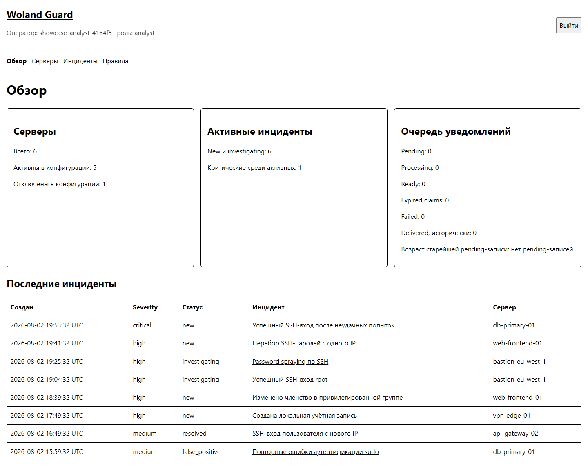
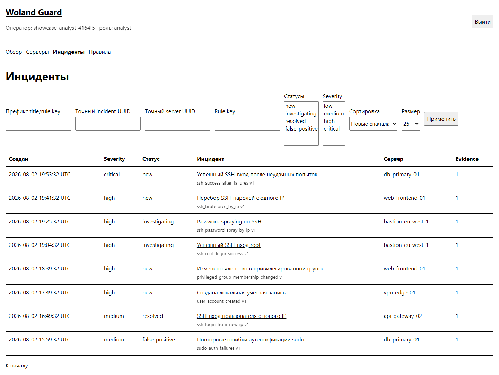
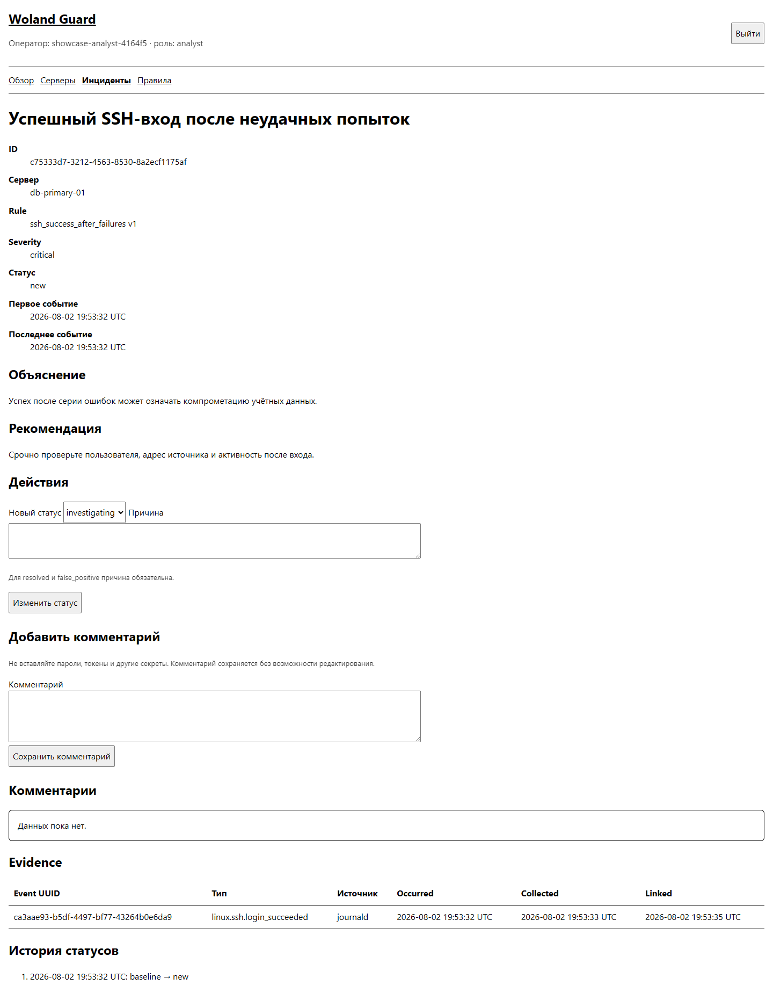
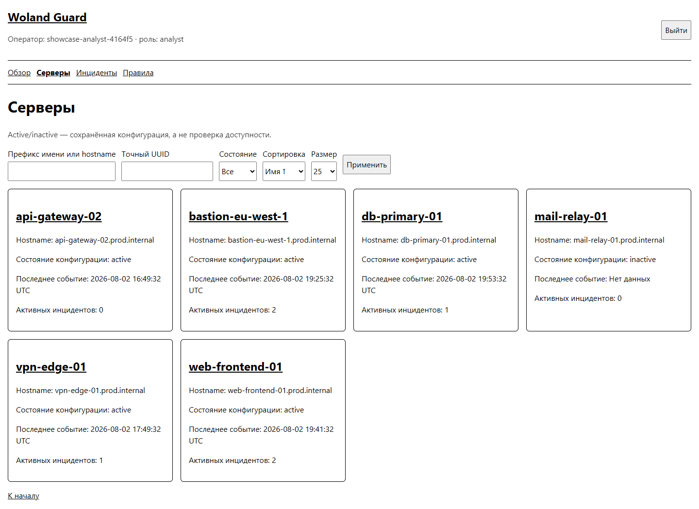
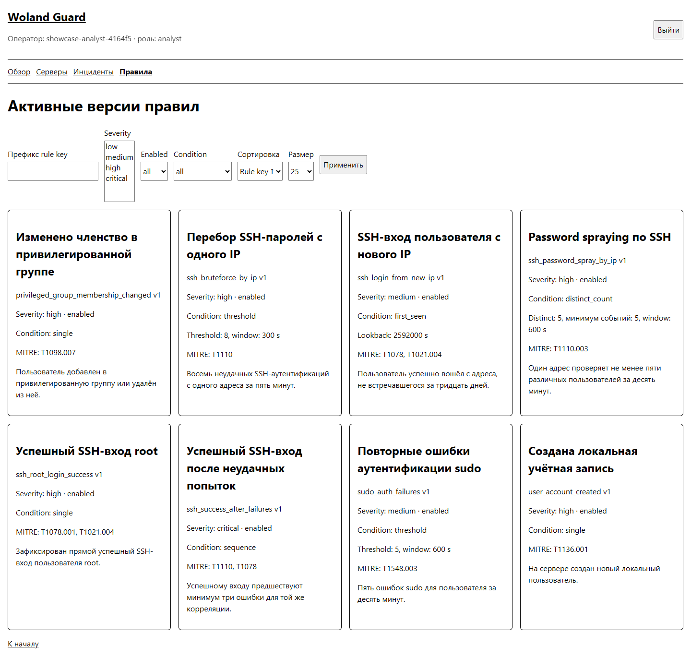
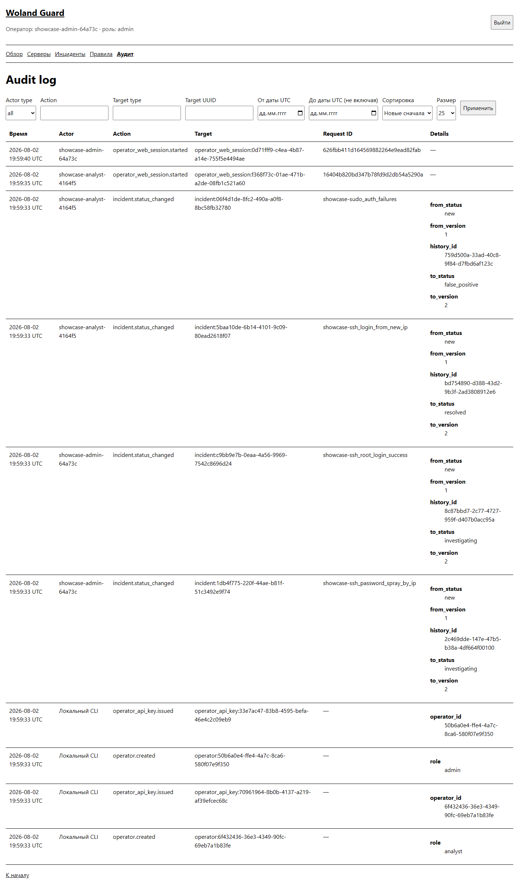
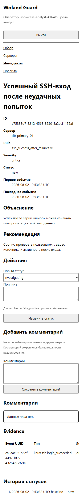

# Woland Guard

*[Читать по-русски](README.md)*

Woland Guard is a defensive Linux server monitoring system. An agent reads permitted system
events, and the control plane turns them into readable incidents and helps an operator respond —
through a protected web Dashboard or interactively through Telegram.

Implemented and committed locally: an ingestion API with a Detection Engine (8 rules, MITRE
ATT&CK), a Linux agent with durable delivery, RBAC and a multi-role Dashboard, outbound and
inbound Telegram notifications (commands, status buttons, reason prompt), a dry-run IP block flow
with an allowlist and a second-administrator approval, three levels of demo infrastructure (from a
manual walkthrough to a full release gate), and 18 ADRs documenting every architectural decision —
including a dedicated decision not to automate IP block execution (ADR-0016).

## License

Copyright (C) 2026 Dr. Woland

Licensed under the [GNU Affero General Public License v3.0](LICENSE) (AGPL-3.0-or-later). The
code may be freely copied, studied, and modified — including for commercial purposes. AGPL's key
difference from MIT/Apache: if you modify the code and offer it as a network service (including
SaaS, without distributing binaries), you must make your version's source available under the same
license. This discourages closed-source competing forks without banning commercial use itself.

## What it looks like

The Dashboard is server-rendered (Jinja2), no JavaScript framework. Screenshots were captured with
a real browser (Chromium) through the project's browser-test infrastructure — the interface shown
is the exact code any user would see. **The data in the screenshots is synthetic**: generated
specifically for this demonstration in an isolated, temporary database, not captured from a live
production instance — a real user will see their own servers and incidents. The UI text itself is
Russian (the project has no i18n layer yet); captions below are in English.

<p align="center">
  
</p>

**Incidents** — filters by status, severity, exact UUID, title/rule key prefix:

<p align="center">
  
</p>

**Incident detail** — explanation, recommendation, status history, evidence, status transition and
comment form:

<p align="center">
  
</p>

**Servers**:

<p align="center">
  
</p>

**Active detection rules** — with MITRE ATT&CK references, conditions, and thresholds:

<p align="center">
  
</p>

**Audit log** — every operator action and system CLI call with typed details:

<p align="center">
  
</p>

**Mobile view** (390×844):

<p align="center">
  
</p>

## What is implemented

- Python 3.12 and a uv workspace;
- a minimal FastAPI application;
- a liveness endpoint `GET /health/live`;
- a readiness endpoint `GET /health/ready` that checks PostgreSQL;
- Docker Compose for the control plane and PostgreSQL;
- a workspace package with a Pydantic contract for the version-1 normalized event;
- models for servers, agent keys, events, and the transactional outbox;
- Alembic migrations with a reversible initial schema change;
- agent key generation that persists only the secret's digest;
- `POST /api/v1/events` with Bearer agent authentication;
- Content-Type, body size, clock skew, and rate limits;
- a request ID in logs, the response header, and the response body;
- a batched transactional insert via PostgreSQL `ON CONFLICT DO NOTHING`;
- a local CLI to create a test server and issue its key exactly once;
- PostgreSQL integration tests in a separate Docker target;
- strict versioned YAML rules with local validate/sync commands;
- a Detection Engine with single, threshold, distinct_count, sequence, and first_seen conditions;
- eight journald rules, atomic incidents, and unique evidence links;
- local operator identities, independently rotatable `wgok_` API keys, and a fixed RBAC matrix;
- safe Incident/Audit APIs, optimistic `lock_version`, immutable history, and audit;
- operator-scoped idempotency for status transitions with persisted 200/404/409 outcomes;
- provider-neutral notification destinations without provider credentials or seed rows;
- a transactional outbox, atomic with the new incident, its baseline history, and evidence;
- a concurrent worker with `FOR UPDATE SKIP LOCKED`, claim tokens, lease recovery, and equal
  jitter;
- safe outbox CLI commands: run/run-once/status/recovery/manual requeue;
- an outbound Telegram adapter with a fixed origin and a bounded streaming response;
- a provider-specific 1:1 Telegram destination config and local management without an HTTP admin
  API;
- on-demand bot token sync from a read-only staging file into a private worker tmpfs;
- an inbound Telegram bot (long polling, default-deny): read-only `/status`, `/servers`,
  `/incidents`, `/critical` commands, account linking only through the local CLI;
- callback buttons under a notification ("Investigate", "False positive", "Close", "Open
  dashboard"), with a mandatory follow-up reason prompt for terminal statuses;
- a dry-run IP block flow over Telegram: a never-block list, an allowlist, a plan with the exact
  `nft` argv, approval from a second administrator — and no execution of the command in any form
  (ADR-0016);
- a Linux agent for Ubuntu Server 24.04: two-phase journald reading, an SQLite spool, explicit safe
  parsers, and HTTPS delivery;
- baseline Ruff, mypy, and pytest configuration;
- 18 ADRs documenting the confirmed architectural decisions of every implemented stage;
- an isolated Chromium browser harness: loopback HTTPS, an ephemeral trustme CA, a dedicated
  PostgreSQL 17 instance, and synthetic data without persistent browser artifacts;
- a closed canonical manifest and a loopback-only sender for synthetic positive, negative, and
  boundary demo scenarios covering all eight detection rules;
- a separate demo topology with PostgreSQL 17, a single migration job, rule sync, 32-scenario
  ingestion, a real outbox worker, an in-process fake Telegram boundary, an HTTPS Dashboard smoke
  check, and a synthetic backup/restore smoke check.

The isolated `/dashboard` HTML boundary logs in with an existing operator API key, then uses only
server-side opaque sessions, strict `__Host-*` cookies, Origin/CSRF checks, bounded URL-encoded
form parsing, and logout with atomic audit. The read-only Dashboard shows a factual overview,
servers, incidents with a bounded evidence projection, paginated history, and append-only comments,
active rules, and an audit page for admins. `analyst` and `admin` perform allowed status
transitions and add comments through a POST with Origin, a session-bound CSRF token, and a
server-generated idempotency key.
Before rendering rules, the Dashboard bound-checks every active definition regardless of filters
and pagination; a corrupted rule closes the page with a safe 503 instead of silently disappearing
from the listing.

## Dashboard browser verification

The browser suite uses Chromium only and must be started explicitly. The browser binary lives in
the ignored `.playwright-browsers` directory; the certificate, private key, PostgreSQL
credentials, and application process are created only in a temporary directory outside the repo.

```powershell
$env:PLAYWRIGHT_BROWSERS_PATH = ".playwright-browsers"
uv run playwright install --no-shell chromium
$env:WG_RUN_BROWSER_TESTS = "1"
uv run pytest tests/browser
```

The harness binds HTTPS to `127.0.0.1:0`, strictly verifies the ephemeral CA with a separate
readiness client, and hands the same open socket to the public Uvicorn API. The non-persistent
Playwright `BrowserContext` uses `ignore_https_errors=True`; this is not a check of the browser's
CA chain. HTTP/HTTPS requests from the tested pages are allowed only to the harness's exact origin,
and any WebSocket is blocked. This does not prove process-level network isolation for Chromium.

Screenshots, traces, video, HAR, downloads, and storage state are disabled by default. A temporary
review run with screenshots is allowed only via `WG_BROWSER_REVIEW_SCREENSHOTS=1`; the files are
written to `.pytest-browser`, reviewed locally, and deleted afterward.

## Requirements

- Python 3.12;
- uv;
- Docker with the Compose plugin.

You need to install these tools yourself from their official sources. The repository contains no
scripts that change system configuration.

## Preparing configuration

PowerShell:

```powershell
Copy-Item .env.example .env
```

Linux:

```bash
cp .env.example .env
```

The example values are for local development only. Replace the PostgreSQL password before any
external deployment.

## Local run with uv

```bash
uv sync --all-packages
uv run uvicorn woland_guard_control_plane.main:app --app-dir apps/control-plane/src --reload
```

Without PostgreSQL, liveness returns 200 and readiness returns 503. This difference is expected.

## Running with Docker Compose

```bash
docker compose config
docker compose up --build -d
docker compose exec control-plane alembic upgrade head
docker compose ps
```

After a successful start:

- <http://localhost:8000/health/live>
- <http://localhost:8000/health/ready>
- <http://localhost:8000/docs>

## Creating a local test key

After running the migrations:

```bash
docker compose exec control-plane woland-guard-admin create-test-agent \
  --name demo-server \
  --hostname demo.invalid \
  --label local-demo
```

The CLI prints the plaintext token exactly once. PostgreSQL stores only the public identifier and
a 32-byte secret digest. Do not put the issued token into `.env`, Git, logs, or examples. There is
no HTTP admin API by design.

## Detection Engine rules

Validating all eight files never touches PostgreSQL:

```bash
docker compose exec control-plane woland-guard-admin validate-rules \
  --rules-dir /workspace/detection-rules
```

After `alembic upgrade head`, an explicit sync appends new versions and atomically activates the
rule set:

```bash
docker compose exec control-plane woland-guard-admin sync-rules \
  --rules-dir /workspace/detection-rules
```

Control plane startup deliberately never changes rules. The YAML format allows only five closed
condition types and never evaluates expressions. Time windows are computed from `occurred_at`,
scoped per server, and inclusive on both ends. Detection only sees rows that were freshly inserted
via `ON CONFLICT DO NOTHING ... RETURNING`, in the same ingestion transaction.

The eight current rules only work with normalized journald events for SSH, sudo, and account
management. Nginx-sourced rules are not part of this set.

## Ingestion API example

Endpoint:

```text
POST /api/v1/events
Authorization: Bearer wgak_<public_id>.<secret>
Content-Type: application/json
X-Request-ID: local-example-001
```

## Synthetic demo scenarios (stage 8A)

The catalog holds four stable scenarios for each of the eight current rules: `positive`,
`negative`, `boundary_below`, and `boundary_exact`. The list is only produced after the
`detection-rules` directory passes strict validation.

```powershell
uv run --package woland-guard-control-plane woland-guard-demo list-scenarios
uv run --package woland-guard-control-plane woland-guard-demo generate `
  --scenario ssh_bruteforce_by_ip.positive.v1 `
  --output C:\wg-demo\ssh-bruteforce-positive.json
uv run --package woland-guard-control-plane woland-guard-demo validate `
  --manifest C:\wg-demo\ssh-bruteforce-positive.json
uv run --package woland-guard-control-plane woland-guard-demo send `
  --manifest C:\wg-demo\ssh-bruteforce-positive.json `
  --origin http://127.0.0.1:8000 `
  --api-key-file C:\wg-demo-secrets\agent.key
```

The manifest output and API key file are passed as absolute paths. The token is never allowed in
arguments, the manifest, or output. The sender accepts only an explicit HTTP/HTTPS loopback origin
and only ever calls `POST /api/v1/events`. It reports the actual accepted/duplicate/rejected
counts, but does not claim that an incident was created or delivered: full-stack verification is a
separate stage-8B verifier's job. Replaying a manifest uses at-least-once delivery with idempotent
ingestion, not distributed exactly-once semantics.

## Full-stack demo verification (stage 8B)

The automated verifier uses a separate `compose.demo.yaml` with a unique Compose project,
ownership label, network, and PostgreSQL volume. It applies migrations in one job, syncs exactly
eight enabled rules from `detection-rules/`, sends all 32 canonical manifests through the public
`POST /api/v1/events`, checks exact DB outcomes, runs a real outbox worker against a demo-only
in-process Telegram transport, runs one desktop Chromium workflow against the same database,
replay, and a custom-format `pg_dump`/`pg_restore` smoke check.

The tracked-only release gate targets an already-committed candidate commit, because `git archive
HEAD` by definition excludes uncommitted files:

```powershell
.\scripts\verify-clean-install.ps1
```

A Linux wrapper exists, but a native Linux full run has not been confirmed yet:

```bash
sh scripts/verify-clean-install.sh
```

Both wrappers build a temporary checkout from `git archive HEAD`, a separate uv environment/cache,
and a Playwright browser cache. Dependency acquisition and the image build may need internet
access on a cold cache. The runtime never calls Telegram: a fake transport checks the constructed
request and only persists a count. The check does not prove real Telegram delivery, process-level
network isolation, or production disaster recovery.

The interactive synthetic demo runs a compact canonical scenario and launches Chromium in a
non-persistent context against a temporary HTTPS harness. It requires a pre-installed Chromium for
the pinned Playwright version, and a new absolute path for the temporary credential file:

```powershell
$env:PLAYWRIGHT_BROWSERS_PATH = ".playwright-browsers"
uv run python -m scripts.demo_e2e.human `
  --project-root (Resolve-Path .).Path `
  --credential-output C:\wg-demo-private\operators.json
```

The file holds only synthetic operator credentials and is deleted along with the demo resources
after Enter/Ctrl+C. POSIX gets mode `0600`; on Windows the verifier does not claim an equivalent
POSIX ACL guarantee, so the target directory must already be private. The agent key, DB password,
Telegram token, certificate, and private key are never printed. Do not interrupt Docker resources
with broad commands: the built-in teardown checks exact project and ownership metadata.

Request body, with timestamps that need replacing with the current UTC value:

```json
{
  "schema_version": 1,
  "batch_id": "10000000-0000-4000-8000-000000000001",
  "sent_at": "<current UTC timestamp>",
  "events": [
    {
      "schema_version": 1,
      "event_id": "20000000-0000-4000-8000-000000000001",
      "occurred_at": "<current UTC timestamp>",
      "collected_at": "<current UTC timestamp>",
      "source": "journald",
      "event_type": "linux.ssh.authentication_failed",
      "actor": "synthetic-agent",
      "source_ip": "192.0.2.10",
      "summary": "synthetic local example",
      "attributes": {"attempt": 1}
    }
  ]
}
```

Successful response:

```json
{
  "request_id": "local-example-001",
  "batch_id": "10000000-0000-4000-8000-000000000001",
  "accepted": 1,
  "existing": 0
}
```

Redelivering the same event returns `accepted: 0`, `existing: 1`.

Stopping:

```bash
docker compose down
```

The named PostgreSQL volume is not removed by this command.

## Checks

```bash
uv run ruff check .
uv run ruff format --check .
uv run mypy
uv run pytest
```

A local run without Compose runs the unit tests and explicitly skips the PostgreSQL integration
tests. Full check:

```bash
docker compose up -d postgres control-plane
docker compose exec control-plane alembic upgrade head
docker compose --profile test run --rm integration-tests
```

Ingestion settings are controlled by these variables:

- `WG_INGEST_MAX_BODY_BYTES` — maximum HTTP body size;
- `WG_INGEST_RATE_LIMIT_REQUESTS` — requests per key per window;
- `WG_INGEST_RATE_LIMIT_WINDOW_SECONDS` — rate-limit window size;
- `WG_INGEST_MAX_CLOCK_SKEW_SECONDS` — allowed `sent_at` skew.

Worker settings:

- `WG_OUTBOX_POLL_SECONDS` — idle-queue pause;
- `WG_OUTBOX_LEASE_SECONDS` — one claim's lifetime;
- `WG_OUTBOX_ADAPTER_TIMEOUT_SECONDS` — upper bound for an adapter call;
- `WG_OUTBOX_RECOVERY_INTERVAL_SECONDS` — expired-claim recovery period; must be positive and not
  exceed the lease;
- `WG_OUTBOX_BACKOFF_BASE_SECONDS` and `WG_OUTBOX_BACKOFF_MAX_SECONDS` — backoff bounds;
- `WG_OUTBOX_RETRY_AFTER_CAP_SECONDS` — a safe cap on `retry_after`;
- `WG_OUTBOX_DEFAULT_MAX_ATTEMPTS` — automatic attempt count for a new row.

## Transactional outbox worker

Migrations never create destinations automatically. Without an enabled destination, a new incident
still commits successfully, just without outbox rows. Migration 0006 adds a 1:1 Telegram
configuration; the bot token is never stored in PostgreSQL.

Safe local commands:

```bash
docker compose --profile telegram-notifications run --rm outbox-worker \
  woland-guard-outbox run-once --limit 10
docker compose exec control-plane woland-guard-outbox status
docker compose exec control-plane woland-guard-outbox recover-expired
docker compose exec control-plane woland-guard-outbox requeue-failed <outbox UUID> \
  --confirm <same outbox UUID> --additional-attempts 1
```

The continuous process is started with `woland-guard-outbox run`; it periodically runs lease
recovery regardless of whether there is a pending backlog, and cooperatively finishes its current
bounded attempt after SIGTERM. Delivery is at-least-once: a crash after an external side effect but
before the PostgreSQL acknowledge can cause a repeat. The `status` command only prints aggregates,
including a non-negative age for the oldest pending row, or `null`.

## Outbound Telegram notifications

The Telegram profile is started separately and is not part of a regular `docker compose up`. The
main `control-plane` container gets neither the staging mount nor the private runtime tmpfs. A
one-shot `telegram-admin` container is used for the local CLI; a separate `outbox-worker` performs
continuous delivery. Both run as UID/GID `10001:10001`, with no capabilities and a read-only root
filesystem.

Create the host directory named by `WG_TELEGRAM_STAGING_DIRECTORY` (default
`./local-secrets/telegram`), and a separate file with a safe basename. The file must hold exactly
one non-empty ASCII line with no whitespace, NUL, or control characters, at most 256 bytes. The
Telegram bot token's shape is deliberately not validated against any unofficial grammar. The token
must never go into `.env`, CLI arguments, PostgreSQL, or Git.

Creating a destination starts it disabled. The chat ID is entered through a hidden prompt and never
printed; `--token-file-name` takes a basename, not a path:

```bash
docker compose --profile telegram-notifications run --rm telegram-admin \
  woland-guard-admin create-telegram-destination \
  --token-file-name local-bot.token --minimum-severity high
```

The CLI only reports `configured` and `staging_file_ready` — a check of the read-only staging
file, not the runtime health of another container's private tmpfs. Once verified, enable the
destination:

```bash
docker compose --profile telegram-notifications run --rm telegram-admin \
  woland-guard-admin enable-notification-destination \
  --destination-id <destination UUID>
docker compose --profile telegram-notifications run --rm telegram-admin \
  woland-guard-admin list-notification-destinations
```

`show-notification-destination`, `disable-notification-destination`, and
`update-telegram-destination` are also available. There is no delete command, to preserve delivery
history. To change the chat ID, the update command uses `--change-chat-id` and a hidden prompt; a
new token is set only through a new `--token-file-name`, never through its contents.

The worker is started separately:

```bash
docker compose --profile telegram-notifications up -d outbox-worker
```

Before every delivery, the worker safely re-checks staging from scratch. It reads the file through
`lstat → open(O_NOFOLLOW) → fstat`, bounds its size, then publishes a private runtime copy with an
atomic replace. The runtime directory is mode `0700`, the file is `0400`, owner and group are
`10001:10001`; `chown` and capabilities are never used. A new destination and a correct atomic
staging rotation are picked up without a restart. An invalid or removed staging file produces a
retryable, safe error code; the previous runtime copy is kept, but the adapter never fails open for
sending.

The HTTP boundary only ever talks to `https://api.telegram.org`, with `trust_env=False`, TLS
verification, no redirects, and zero internal HTTP retries. Connect/read/write/pool timeouts are
bounded and together never exceed the adapter budget — these are phase timeouts, not a promise of a
separate wall-clock deadline. The response is read as streaming chunks up to a hard 64 KiB limit
and only then parsed as JSON. The `httpx2`/`httpcore2` loggers are suppressed before the request is
even built, independent of the root logger, because the token is part of the URL. A notification is
plain text with no `parse_mode`, and never contains event payload, attributes, correlation, actor,
or IP data.

## Architectural decisions

Accepted decisions are recorded in
[`docs/adr/0001-mvp-foundation.md`](docs/adr/0001-mvp-foundation.md).
The contract and storage design is described in
[`docs/adr/0002-event-contract-and-persistence.md`](docs/adr/0002-event-contract-and-persistence.md).
The ingestion API is described in
[`docs/adr/0003-ingestion-api.md`](docs/adr/0003-ingestion-api.md).
The Linux agent architecture is described in
[`docs/adr/0004-linux-agent.md`](docs/adr/0004-linux-agent.md).
The Detection Engine architecture is described in
[`docs/adr/0005-detection-engine.md`](docs/adr/0005-detection-engine.md).
The consolidated stage-6 architecture is described in
[`docs/adr/0006-operator-rbac-incident-workflow-and-telegram.md`](docs/adr/0006-operator-rbac-incident-workflow-and-telegram.md).
Dashboard authentication and sessions are described in
[`docs/adr/0007-dashboard-authentication-and-sessions.md`](docs/adr/0007-dashboard-authentication-and-sessions.md).
The read-only Dashboard and its query projections are described in
[`docs/adr/0008-read-only-dashboard.md`](docs/adr/0008-read-only-dashboard.md).
Incident actions and append-only comments are described in
[`docs/adr/0009-dashboard-incident-actions-and-comments.md`](docs/adr/0009-dashboard-incident-actions-and-comments.md).
Browser verification is described in
[`docs/adr/0010-dashboard-browser-verification.md`](docs/adr/0010-dashboard-browser-verification.md).
The canonical demo catalog is described in
[`docs/adr/0011-reproducible-synthetic-demo.md`](docs/adr/0011-reproducible-synthetic-demo.md).
Clean-install and full-stack demo verification are described in
[`docs/adr/0012-clean-install-and-demo-e2e.md`](docs/adr/0012-clean-install-and-demo-e2e.md).
Inbound Telegram commands are described in
[`docs/adr/0013-inbound-telegram-commands.md`](docs/adr/0013-inbound-telegram-commands.md).
Incident callback buttons and the reason prompt are described in
[`docs/adr/0014-telegram-incident-action-buttons.md`](docs/adr/0014-telegram-incident-action-buttons.md).
The dry-run IP block flow is described in
[`docs/adr/0015-dry-run-ip-block-plans.md`](docs/adr/0015-dry-run-ip-block-plans.md).
The decision against automated block execution is described in
[`docs/adr/0016-no-automated-block-execution.md`](docs/adr/0016-no-automated-block-execution.md).

## Local operators

An operator and their authentication methods are separate entities. There is no HTTP admin API.
First create the identity locally:

```bash
docker compose exec control-plane woland-guard-admin create-operator \
  --username local-admin --role admin
```

Then issue a key against the printed `operator_id`. The optional `--expires-at` only accepts an
ISO 8601 timestamp with a timezone:

```bash
docker compose exec control-plane woland-guard-admin issue-operator-key \
  --operator-id <operator UUID> --label local-cli \
  --expires-at 2030-01-01T00:00:00+00:00
```

The CLI shows the `wgok_` token exactly once. PostgreSQL only stores its digest. Rotation
atomically revokes the previous key and issues a new one:

```bash
docker compose exec control-plane woland-guard-admin rotate-operator-key \
  --key-id <key UUID>
docker compose exec control-plane woland-guard-admin revoke-operator-key \
  --key-id <key UUID>
```

## Read-only Dashboard

The Dashboard is mounted at `/dashboard`. Login accepts a valid operator API key, and after success
uses only a server-side web session — the Bearer header is not an alternative Dashboard cookie.
`analyst` and `admin` can see the overview, servers, incidents, and active rules; the audit page is
`admin`-only.

Cookies require `Secure`, so a plain HTTP Compose URL does not weaken the policy and is not a
ready-made browser deployment. Interactive viewing needs a configured HTTPS origin that exactly
matches `WG_WEB_PUBLIC_ORIGIN`. The REST API and health endpoints keep working independently of the
HTML handlers.

Pages use server-side keyset pagination with page sizes of 25, 50, or 100. The cursor is strictly
validated and bound to the page, filters, literal prefix, sort order, and page size, but it is not
signed and makes no tamper-proof claim. Search treats `%`, `_`, and `!` literally; an exact UUID
goes through a separate filter. Times are shown in UTC.

`active`/`inactive` for a server is only the persisted `Server.is_active` flag, not
online/offline and not a health check. The last-event time is a separate `occurred_at` maximum. The
Dashboard never shows event payload, attributes, actor, IP, correlation, API keys, cookies, or
Telegram credentials. Evidence only holds the event UUID, event type, source, and three UTC
timestamps. Stage 7C adds separate POST-only forms for status transitions and comments. They reuse
the existing workflow and current RBAC after a PostgreSQL row lock, plus a PRG redirect; comments
never end up in audit details, the outbox, Telegram, or application logs.

## Incident workflow and audit

`viewer`, `analyst`, and `admin` can read safe summaries and detail views without the event
payload:

```text
GET /api/v1/incidents?status=new&severity=critical&limit=50
GET /api/v1/incidents/<incident UUID>
Authorization: Bearer <operator token>
```

`analyst` and `admin` can change the status. The required fields are the current
`expected_version` and an `Idempotency-Key` unique within the operator's scope. `resolved` and
`false_positive` require a `reason`:

```text
POST /api/v1/incidents/<incident UUID>/transitions
Authorization: Bearer <operator token>
Idempotency-Key: local-review-001
Content-Type: application/json

{"status":"resolved","expected_version":1,"reason":"Reviewed by a local operator"}
```

Only `new → investigating|resolved|false_positive` and `investigating →
resolved|false_positive` are allowed; terminal statuses are never reopened. Repeating an identical
request returns the original business snapshot and an `Idempotency-Replayed: true` header. The same
key with a different normalized request returns 409.

Only `admin` reads the append-only audit log through `GET /api/v1/audit-log`. The cursor in both
list APIs is strictly validated and bound to the normalized filters, but is not cryptographically
signed. History, audit, and idempotency rows are protected by PostgreSQL triggers against `UPDATE`,
`DELETE`, and `TRUNCATE`; the table owner and the PostgreSQL superuser remain outside this
protection.

## Linux Agent

The `apps/agent` package targets Ubuntu Server 24.04 LTS only. It reads journald through a fixed
`journalctl` invocation, atomically persists the event and cursor in a SQLite WAL, and delivers
batches over HTTPS. Safe configuration, the overflow policy, the systemd unit, and diagnostic
commands are described in [`apps/agent/README.md`](apps/agent/README.md).

The current Windows/Docker environment does not include an Ubuntu 24.04 host with systemd running.
No real journald verification is claimed here: the automated tests only use synthetic fixtures and
a local HTTP backend.

The nginx source/parser and the two rules that need its events are deferred to a future release.
They do not count as MVP end-to-end features; the current Detection Engine ships eight journald
rules, not ten end-to-end rules.

## Inbound Telegram bot

The bot is a separate process and a separate Compose service under the `telegram-notifications`
profile. It reads updates through `getUpdates` with the same fixed-origin client used for outbound
delivery, and answers **only linked operators, and only in a private chat**.

Linking is done only through the local CLI; one-time codes over chat are not used, so the secret
never ends up in Telegram's chat history. An unlinked user gets their own Telegram ID back, to pass
along to an administrator:

```bash
docker compose exec control-plane woland-guard-admin link-telegram-operator \
  --operator-id <operator UUID> --telegram-user-id 123456789
docker compose exec control-plane woland-guard-admin list-telegram-operators
docker compose exec control-plane woland-guard-admin revoke-telegram-operator \
  --link-id <link UUID>
```

Starting the bot:

```bash
docker compose --profile telegram-notifications up -d telegram-bot
```

Available commands: `/help` for any linked operator; `/status`, `/servers`, `/incidents`, and
`/critical` require the `VIEW_INCIDENTS` permission. Every reply is built from fixed strings and
explicit DB columns, is length-bounded, and never reflects user input.

Telegram returns `409 Conflict` for a second concurrent `getUpdates` call with the same token, so
the service must run **strictly as a single instance** and is incompatible with a configured
webhook. The offset is stored in PostgreSQL and confirmed only after a batch is processed, so a
restart causes a replay, not a loss of updates.

### Status buttons under a notification

A new-incident notification carries a keyboard: "Investigate", "False positive", "Close" (require
`TRANSITION_INCIDENTS`), and "Open dashboard" (a plain URL button to the Dashboard, no bot round
trip). Pressing a button calls the same `transition_incident` that REST and the Dashboard use —
directly, with no HTTP involved. The reply is visible only to the presser
(`answerCallbackQuery`), not to the whole chat.

"False positive" and "Close" lead to a terminal status that requires a reason: the bot never
substitutes a template, it asks for the reason in a follow-up private message (1–1000 characters,
bounded by `WG_TELEGRAM_BOT_PENDING_ACTION_TTL_SECONDS`). Any recognized command cancels the
pending reason prompt and runs normally. Idempotency is keyed on `callback_query.id`, which
Telegram guarantees unique, so redelivering the same button press never creates a duplicate
transition.

### IP block (dry-run)

The keyboard carries a fourth button — "Prepare an IP block" (requires `PROPOSE_IP_BLOCK`, granted
to the analyst and admin roles). **Woland Guard never executes the block command** — neither the
control plane nor the agent. The button only creates a plan and shows the exact `nft` argv; an
administrator applies it by hand. This is a final architectural decision
([ADR-0016](docs/adr/0016-no-automated-block-execution.md)): the only process able to run the
command on the protected host is the agent, and it parses untrusted journald input by design —
handing it the privilege to change the firewall was an unacceptable trade-off. The feature is
entirely disabled by default (`WG_IP_BLOCK_ENABLED=false`).

The address comes from the incident's correlation (`source_ip`), never from operator input; for an
incident without that field, the button replies with a refusal instead of creating a plan. A
never-block list (loopback, private, link-local, multicast, documentation ranges) and an allowlist
are both checked before a plan is created; the allowlist is managed only through the local CLI:

```bash
docker compose exec control-plane woland-guard-admin add-ip-allowlist-entry \
  --cidr 203.0.113.0/24 --label "admin-jump-host" --reason "administrator address"
docker compose exec control-plane woland-guard-admin list-ip-allowlist-entries
docker compose exec control-plane woland-guard-admin revoke-ip-allowlist-entry \
  --entry-id <entry UUID>
```

A plan requires approval from a **different** admin operator
(`WG_IP_BLOCK_REQUIRE_SECOND_OPERATOR=true` by default) — neither the proposing analyst nor the
same administrator can approve their own proposal. Approval re-checks the policy from scratch: if
the allowlist changed since the proposal, the plan is automatically rejected instead of approved.
The approval reply explicitly states that nothing was executed — the only safeguard against the
most dangerous misunderstanding in this flow. Full reasoning is in
[ADR-0015](docs/adr/0015-dry-run-ip-block-plans.md) and
[ADR-0016](docs/adr/0016-no-automated-block-execution.md).

## MVP limitations

- Telegram cannot add a comment to an incident yet — a future stage, if it gets built;
- IP blocking is **always** dry-run only: a plan is created, checked, and approved, but the
  project never executes it. This is a deliberate, final decision, not unfinished work — see
  [ADR-0016](docs/adr/0016-no-automated-block-execution.md);
- an administrator applies an approved command by hand; they also create the nftables table and
  sets themselves (see [docs/deployment.md](docs/deployment.md));
- lifting a block is neither tracked nor automated by the project;
- the original message with the buttons is never edited after a press, the buttons stay visible;
- there is no HTTP API for managing servers and keys;
- delivery stays at-least-once and can repeat after an external side effect before the
  acknowledge;
- the rate limiter keeps state in a single process's memory and does not coordinate across
  multiple control-plane instances;
- the rate limiter only counts requests after successful authentication; requests rejected by
  middleware or JSON validation earlier need a limit at the reverse proxy;
- there is no automatic key rotation or old-event cleanup;
- rule sync runs only through an explicit local CLI command, never at startup;
- history queries run separately for trigger/rule; that optimization is deferred until it is
  actually measured;
- readiness checks the PostgreSQL connection but not yet whether the migration is current;
- Python dependencies are pinned in `uv.lock`;
- production deployment has not been set up.

## Documentation

- [docs/architecture.md](docs/architecture.md) — components and the event flow from agent to
  notification;
- [docs/threat-model.md](docs/threat-model.md) — the threat model;
- [docs/detection-rules.md](docs/detection-rules.md) — the YAML rule schema and the current set of
  8;
- [docs/deployment.md](docs/deployment.md) — VPS deployment, HTTPS, reverse proxy;
- [docs/agent-installation.md](docs/agent-installation.md) — installing the agent on Ubuntu Server
  24.04;
- [docs/demo.md](docs/demo.md) — the three demo-mode levels, from manual to a full release gate;
- [docs/adr/](docs/adr/) — architectural decisions for every implemented stage;
- [SECURITY.md](SECURITY.md) — how to report vulnerabilities;
- [CONTRIBUTING.md](CONTRIBUTING.md) — how to contribute changes.
