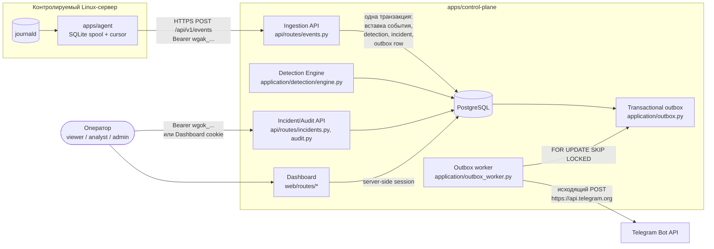

# Архитектура

Этот документ описывает, как компоненты Woland Guard устроены и как между ними течёт запрос,
на основе того, что реально реализовано (см. `docs/adr/*.md` для решений по каждому этапу).

## Компоненты

## Поток события от сервера до уведомления

1. **Агент** (`apps/agent`) двумя фазами читает `journalctl`, локально распознаёт только пять
   классов сообщений (SSH login/failure, sudo failure, создание пользователя, изменение
   привилегированной группы), атомарно сохраняет `NormalizedEventV1` вместе с journald cursor
   в SQLite (`BEGIN IMMEDIATE`) и отправляет накопленные пакеты по HTTPS с Bearer-токеном
   агента.
2. **Ingestion API** (`POST /api/v1/events`, `api/routes/events.py`) аутентифицирует агента по
   `wgak_<public_id>.<secret>`, ограничивает `Content-Type`/размер тела/частоту запросов,
   проверяет `sent_at`/`collected_at` относительно UTC control plane и вставляет пакет одним
   `INSERT ... ON CONFLICT DO NOTHING ... RETURNING` по `(server_id, agent_event_id)`.
3. **Detection Engine** (`application/detection/engine.py`) получает только фактически
   вставленные строки той же транзакции, оценивает версионированные YAML-правила
   (`single`/`threshold`/`distinct_count`/`sequence`/`first_seen`), берёт advisory lock по
   `(server_id, rule_version_id, correlation_hash)` и либо создаёт новый `Incident`, либо
   добавляет evidence к уже открытому.
4. Тот же commit атомарно создаёт baseline `incident_history` и, если есть включённый
   `notification_destination`, строку в **transactional outbox**.
5. **Outbox worker** (`application/outbox_worker.py`) захватывает строку через
   `SELECT ... FOR UPDATE SKIP LOCKED`, после коммита вызывает Telegram adapter, использует
   exponential backoff с jitter при ошибке и восстанавливает зависшие claims по lease timeout.
6. **Оператор** читает и меняет статус инцидента через REST (`Bearer wgok_...`) или через
   **Dashboard** (`/dashboard`, server-side session, отдельная от Bearer-аутентификации). Оба
   пути проходят одну и ту же RBAC-матрицу (`application/rbac.py`) и один и тот же
   `application/incident_workflow.py`.

## Слои control plane

`apps/control-plane/src/woland_guard_control_plane/`:

- `api/` — REST-граница (`/api/v1/events`, `/api/v1/incidents`, `/api/v1/audit-log`,
  `/health/*`), middleware, dependencies, ошибки;
- `web/` — Dashboard sub-application, смонтированная на `/dashboard` (Jinja2 + HTMX,
  собственные routes, CSRF, сессии, security headers);
- `application/` — доменная логика без привязки к FastAPI: RBAC, detection, incident workflow,
  outbox, аутентификация операторов, agent/operator key management, аудит, пагинация, rate
  limiting;
- `infrastructure/` — SQLAlchemy-модели, Telegram HTTP-адаптер и protocol-уровневая защита;
- `demo/` — генератор синтетических сценариев для 10 правил (не часть production runtime).

Это модульный монолит (см. ADR-0001): один процесс/образ, разделение — модулями, а не
отдельными сетевыми сервисами.

## Хранилище

Единственное обязательное хранилище — PostgreSQL. Redis и отдельные очереди сознательно не
используются (ADR-0001); надёжная доставка построена на PostgreSQL transactional outbox с
`SELECT FOR UPDATE SKIP LOCKED`. `events.payload` хранится как `JSONB`, идемпотентность и
основные запросы — в типизированных столбцах. Схема версионируется только через Alembic-миграции
с симметричными `upgrade`/`downgrade`.

## Точки расширения (заложены, но не реализованы в MVP)

- `JournalSource`-подобный интерфейс источника агента допускает файловые/Nginx-адаптеры без
  переписывания ядра агента — их код отложен до следующего релиза (см.
  [Ограничения MVP](../README.md#ограничения-mvp));
- `notification_destinations` — provider-neutral таблица; Telegram — единственный реализованный
  adapter, но схема не привязана к одному провайдеру;
- Dashboard читает только через `application/*_queries.py` — замена шаблонного рендеринга на
  отдельный React-фронтенд не потребует переписывать доменную логику.

## Дальнейшее чтение

Подробности каждого решения — в соответствующем ADR: `docs/adr/0001` (базовая архитектура) —
`docs/adr/0016` (отказ от автоматического исполнения блокировки). Модель угроз — в
[docs/threat-model.md](threat-model.md).
